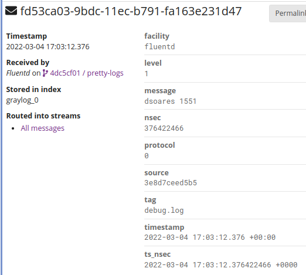

# Sobre a resolução do _timestamp_ no Graylog

O Graylog só suporta _timestamps_ com resolução ao milissegundo.

1. Ainda que as aplicações python enviem um timestamp com nanossegundos, 
esse valor nunca seria interpretado pelo Graylog porque:

    > every instance of DataTime is from the org.joda.time.DateTime library and
    > from what I can tell, joda-time does not support microseconds
    <small>(https://community.graylog.org/t/extract-timestamp-from-message/18819/3)</small>

    De facto, `org.joda.time` não suporta micro nem nano segundos:

    > Joda-Time only stores date/time values down to the millisecond - just like
    > java.util.Date and java.util.Calendar. So no, there's no way you can
    > precisely represent 412340 microseconds within the second (which is what
    > your text representation shows).
    >
    > The java.time package in Java 8 has nanosecond granularity - if you
    > can use that instead, you should be fine.

    O `org.joda.time` é usado em múltiplos ficheiros, um PR iria requerer um
    esforço considerável. (?compensa?...)

2. Ainda assim, atualmente, o timestamp com resolução ao nanossegundo enviado
pelas apps em python não está a chegar ao Graylog, perde-se logo no fluentd.
(NOTA: confirmei que o valor que chega ao fluentd tem resolução ao nanossegundo)

    Olhando para o código do plugin de output gelf (que está a ser usado na imagem
    docker do `it-flogup`):

    ```ruby
      def format(tag, time, record)
        if defined? Fluent::EventTime and time.is_a? Fluent::EventTime then
          timestamp = time.sec + (time.nsec.to_f/1000000000).round(3)
        else
          timestamp = time
        end
    ```

    ou seja, com `round(3)` o valor de timestamp fica com resolução ao milissegundo
    e tudo o resto é perdido. Alterar para `round(9)` não vale a pena (ver 1.)

3. No máximo, alterei o plugin para que adicione sempre 2 campos à mensagem:
    - `nsec` apenas com o valor de nanosegundos
    - `ts_nsec` timestamp com valor de nanosegundos

    ```diff
   diff --git a/lib/fluent/plugin/out_gelf.rb b/lib/fluent/plugin/out_gelf.rb
   index cedb0d5..3bde89a 100644
   --- a/lib/fluent/plugin/out_gelf.rb
   +++ b/lib/fluent/plugin/out_gelf.rb
   @@ -6,6 +6,7 @@ class GELFOutput < BufferedOutput
    
      config_param :use_record_host, :bool, :default => false
      config_param :add_msec_time, :bool, :default => false
   +  config_param :add_nsec_field, :bool, :default => false
      config_param :host, :string, :default => nil
      config_param :port, :integer, :default => 12201
      config_param :protocol, :string, :default => 'udp'
   @@ -53,6 +54,12 @@ class GELFOutput < BufferedOutput
    
        gelfentry = { :timestamp => timestamp, :_tag => tag }
    
   +    if @add_nsec_field then
   +      tf = Fluent::TimeFormatter.new('%Y-%m-%d %H:%M:%S.%N %z', true, nil)
   +      gelfentry[:ts_nsec] = tf.format(time)
   +      gelfentry[:nsec] = time.nsec
   +    end
   +
        record.each_pair do |k,v|
          case k
          when 'version' then
    ```

    Para ativar esse modo do plugin, bastaria configurar o plugin assim:

    <pre>&lt;match **&gt;
      @type gelf
      host "#{ENV['GRAYLOG_HOST']}"
      port "#{ENV['GRAYLOG_PORT']}"
      <strong style="color:green">add_nsec_field true</strong>
      (...)
    &lt;/match&gt;</pre>

    Exemplo de entrada no Graylog:

    

Nota final: não encontrei forma de alterar a ordem da listagem de
mensagens/eventos no Graylog com base em outros campos que não o timestamp.